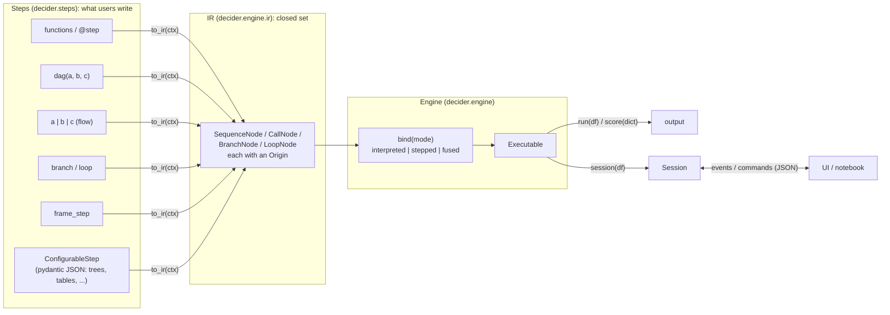
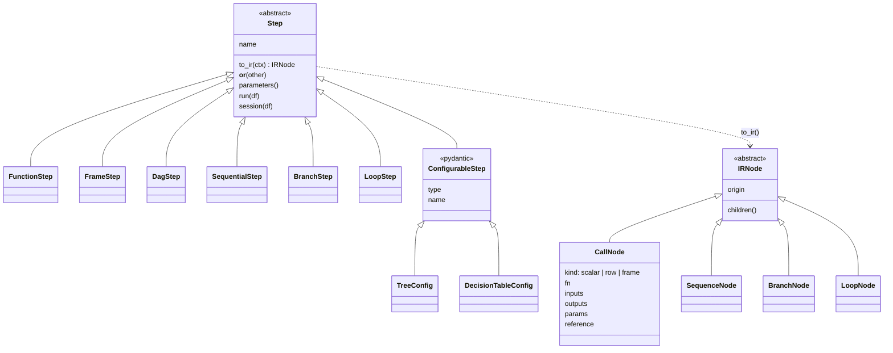
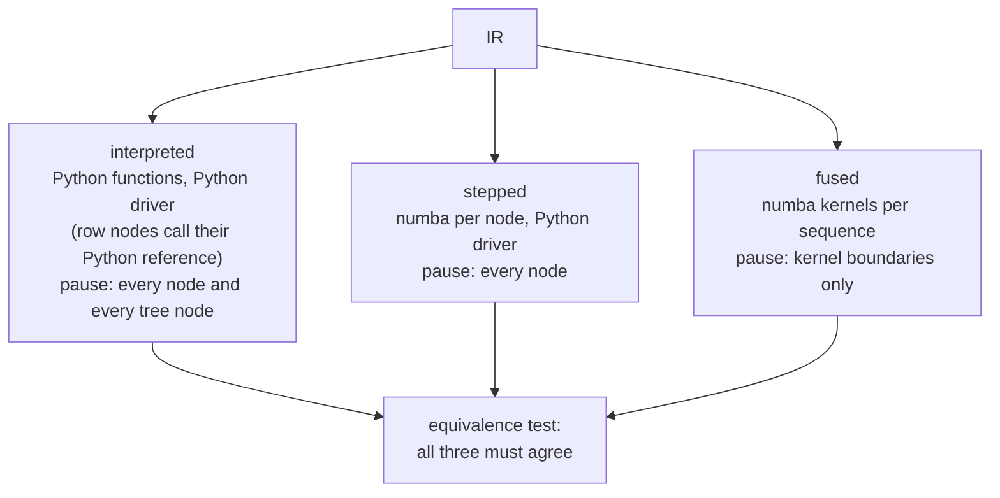
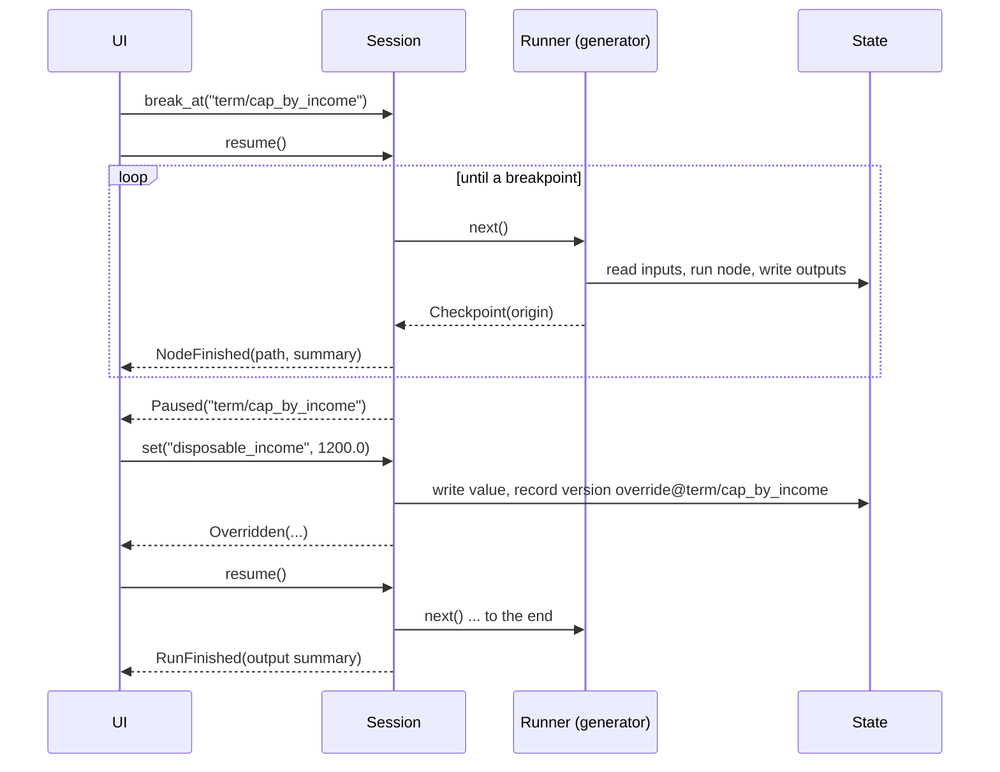

# decider: design

Status: **agreed**. Companion documents:
- `IR.md`: the step and IR contract, signed off;
- `notes/`: decision records, the migration log (`progress.md`) and agreed amendments to both documents (`spec-amendments.md`).

Edit inline; mark feedback with `>>> ... <<<`.

---

## 1. Goal

Consolidate `decider_old` and `decider2` into one package, `decider`, that is
numba-first. It keeps decider_old's configurable, serialisable design and
decider2's compiled engine.

Success criteria:

1. **It is easy to make steps from functions.** A plain Python function is a
   step.
2. **Steps can be executed directly with data** in an execution engine, in
   interpreted, stepped or fused (compiled) mode.
3. **A run can be stepped through, adjusted and paused**, in a way that can
   drive a UI later. Events stream out ("on step x, internal state is ..."), and
   commands go in ("set x and continue", "pause at step y").

---

## 2. Where we started

| | Keeps | Leaves behind |
|---|---|---|
| **decider_old** | Pydantic, type-tagged, registry-backed configurable steps; functions as steps; versioned JSON configs; the overridable serving handler; tree format upgrades (v1 → v3) | Polars expressions as the internal representation (can't compile); opaque nesting; no execution hooks; per-kind CLI step-through; recompiling on every call; hidden global state; the `pull_version` bug (`config/core.py:131`) |
| **decider2** | Functions as steps with `param()` knobs in the signature; build-time wiring errors with did-you-mean; the flat step list plus the name → array store; interpreted / stepped / fused modes with the equivalence test; params as kernel arguments (retuning never recompiles); trees and tables as data walked by compiled kernels; the boundary and arrow layer; the precompile and serving handles | Verbose docstrings full of doc references; one-level owner tracking; opaque packed steps with no Python reference; runners with no hook points; several parallel calling conventions. Its docs also describe features that were **never built**: `debug()`, `observe/`, `fuse()`/`parallel()`, `Vocabulary`, `round_half_up`, pydantic modules |
| **decider (new)** | Already moved: `registry/` (subclasses register on a `Literal` tag), `serializable/`, `serving/`, `settings.py`, `exceptions.py` | Not importable yet: `serving/handler.py` and `settings.py` import `decider.config`, `GraphModule` and `decider.executor`, none of which exist. The top-level `tests/` are decider_old tests against those missing modules |

---

## 3. Decisions

Each line is settled. Rationale worth keeping long-term goes in `notes/`.

| # | Decision |
|---|---|
| D1 | **Pipeline structure lives in Python.** Config carries params documents and `ConfigurableStep` documents only. decider_old tried structure in config, and two sources of truth for structure proved confusing. The path back to config-defined structure is left open: the combining steps can gain configurable forms later without a redesign. |
| D2 | **Two layers: steps and the IR.** Users write *steps*; every step produces its own expanded IR through `to_ir()`; the engine runs the IR. Nothing is called "module". |
| D3 | **The IR is closed:** `CallNode`, `SequenceNode`, `BranchNode`, `LoopNode`. Modes, the debugger and the compiler are implemented once per node type. A new step type only implements `to_ir()`. |
| D4 | **Pydantic appears in exactly three places:** `ConfigurableStep`, params models, and the JSON boundary for events and commands. Everything else is a frozen, slotted dataclass. |
| D5 | **Functions convert automatically;** `@step` is optional. `dag(...)` orders by dependencies, and `flow(...)` / `\|` keeps written order (the waterfall). |
| D6 | **Every IR node carries an origin:** a path plus the import path of the code that produced it. Origins never enter compile cache keys or generated identifiers; compiled code is keyed by content. |
| D7 | **Numba-first.** The polars expression tier is dropped. Polars remains for frame steps: joins, filters, aggregations and model calls. |
| D8 | **Missing values are an error by default**, declared per input (`missing_as(x)`, `T \| None`). decider2's pipeline-wide refer/decline routing is dropped. |
| D9 | **Params are nested by path, with `param(shared_key=...)`** for values shared across steps. Only shared *types* are checked globally. Validation is per node, cached per params document, with an engine-level `eager`/`lazy` mode; lazy validates on first hit. |
| D10 | **Config values are either literals or param references**, chosen per value in the JSON (`Value[T]`, `TableValue`). Retuning a reference, including every row of a table, never rebuilds or recompiles. |
| D11 | **`ConfigurableStep` type tags:** the import path by default, plus an optional short alias. Loading by import path only accepts `ConfigurableStep` subclasses. |
| D12 | **Runners are generators.** Running and debugging share one code path, with one yield per node and none per row. |
| D13 | **Serving imports the pipeline from code**, and takes params and configurable-step documents from the config store. It keeps the SageMaker routes and the overridable `Handler` in `inference.py`. Config changes go through explicit stage / activate / rollback, not background polling. |

The full step and IR specification is **`IR.md`**; it is the contract for all
later work.

---

## 4. Architecture

### 4.1 From authoring to running



### 4.2 The two class families



### 4.3 One IR, three modes



- **One standard driver for every `CallNode`:** gather the declared inputs from
  arrow, call, scatter the outputs.
- **Params always arrive as arguments.**
- **Nodes are grouped into kernels by the compiler**, one kernel per sequence by
  default. That is a compiler decision, never an IR property. An explicit
  `fuse()` / `parallel()` may come later.

### 4.4 A debug session



---

## 5. The engine

### 5.1 State

- `State` wraps the name → array store with validity masks and **version
  chains**.
- Every write records a version whose producer is the node's origin path.
  `name@path` resolves to a specific version, and `name@*` gives every version.
- An override from a session records a version whose producer is
  `override@<path>`, so what-if edits appear in the audit trail rather than
  hiding in it.

### 5.2 Runners

- `Runner.iterate(ir, state) -> Iterator[Checkpoint]`.
- There is one runner per mode: `interpreted`, `stepped` and `fused`.
- `Executable.run()` drains the generator; a `Session` drives it one checkpoint
  at a time.
- `score(dict)` is the single-record fast path. It uses the same kernels as the
  other modes and bypasses polars.

### 5.3 Session

| Command | Effect |
|---|---|
| `break_at(path_or_prefix_or_predicate)` / `clear_break(...)` | Set or clear a breakpoint. A prefix such as `"term"` stops at the first node under it. `risk_tree#n17` targets a node inside a tree |
| `step()` | Advance one node, stepping *over* branches and loops |
| `step_into()` | Enter the taken arm, the loop iteration, or, in interpreted mode, the tree's reference walker |
| `resume()` / `pause()` | Run to the next breakpoint, or stop at the next checkpoint |
| `set(name, value)` | Override a value (a step output *or* an input column). The value is cast to its declared dtype, and a failed cast is an error |
| `rewind(path)` | Re-run from `path` with the current state. Steps are pure, so this is correct |
| `replace(path, step)` / `delete(path)` | Edit the pipeline inside a live session, regenerate IR for that subtree, and re-run downstream (T6.5) |

- `state`, `events` and `current` are available for inspection.
- **Events** (`RunStarted`, `NodeStarted`, `NodeFinished`, `NodeVisited`,
  `Paused`, `Overridden`, `ParamsValidated`, `Warning`, `Error`, `RunFinished`)
  and **commands** are frozen dataclasses in tagged unions. They are serialised
  to JSON at the transport edge through a pydantic `TypeAdapter`.
- **Event payloads carry summaries** (dtype, a few preview rows, null count), and
  a UI fetches full values on demand. Per-record values are PII, so streaming
  them wholesale is a governance problem, not only a size one.
- **The core is pull-based and synchronous.** A websocket adapter (T6.4) is a
  thin push layer on top.

### 5.4 Params at run time

This summarises `IR.md` §5.
- Params documents are nested by path, with a top-level `"shared"` key.
- Each node has its own generated pydantic model.
- Validation is cached per `(params document, node)`.
- `eager` mode validates every node up front and fails fast. `lazy` mode
  validates a node on its first hit, and applies `on_invalid` only to nodes that
  run.
- Bundles for nodes that haven't been validated yet use their defaults, which
  have the same type, so nothing ever recompiles.

---

## 6. Configurable steps and the registry

- `ConfigurableStep` is the registry root. It is frozen pydantic with
  `extra="forbid"`, and composes with any step (`IR.md` §3.6).
- **Registry changes needed** (T2.1):
  1. Type tags: the import path by default, plus an optional `Literal` alias;
     loading by import path checks the class is a subclass.
  2. Nested dispatch: a `StepRef` field type (`Annotated[ConfigurableStep,
     WrapValidator(dispatch_by_tag), SerializeAsAny()]`).
     - Without `SerializeAsAny`, pydantic serialises a nested subclass as its
       base type and **drops the subclass's fields**.
  3. Replacing an entry for the same qualified name is allowed, for notebook
     reloads. A different class claiming the same alias is an error.
  4. `json_schema()` over every registered class, for UI forms.
  5. Did-you-mean suggestions for unknown tags.
- Dispatch is a lookup at validation time. There is no discriminated union
  rebuilt on each registration, so decider_old's stale-union problem can't
  happen. The Python-side lookup costs about 15 µs more on a 63-node config,
  which is irrelevant because configs are validated once and cached.
- **Built-in configurable steps** (Phase 4):
  - `TreeConfig`: decider_old's v3 tree vocabulary, with `Value[float]`
    thresholds;
  - `DecisionTableConfig`: `TableValue` rows;
  - scorecard.

  Each one's `to_ir` emits a `row` `CallNode`, whose `fn` is a numba walker
  over encoded arrays and whose `reference` is a Python walker that reports
  node visits.

---

## 7. Config store and serving

- **Config store** (from decider_old `config/`):
  - pluggable backends with versioned documents;
  - fix `pull_version`;
  - remove the 10-second polling loop that swallows exceptions.
- **Serving:**
  - the handler imports the pipeline from code (D1/D13) and loads params and
    configurable-step documents from the store;
  - it keeps `GET /ping` and `POST /invocations` (a SageMaker contract) and the
    overridable `Handler` in `inference.py`;
  - swaps go through decider2's stage / activate / rollback, which is explicit
    and measured.
- **Nothing in `engine/` imports from `serving/`.** The core's entry point is
  `score(dict)` / `run(df)`.

---

## 8. Project structure

```
decider/
  __init__.py                 # public API re-exports
  exceptions.py  settings.py
  registry/                   # tag registry: import paths, aliases, nested refs, schema export
  steps/                      # authoring layer (public)
    base.py  function.py  frame.py  dag.py  sequential.py  branch.py  loop.py
    configurable.py  values.py
    trees/  tables/  scorecard/   # built-in ConfigurableSteps
    expr/                     # closed expression grammar for computed features
  engine/
    ir/                       # nodes.py  origin.py  context.py  decls.py
    params/                   # declare.py  harvest.py  models.py  bundles.py  validate.py
    wiring/                   # interface.py  resolve.py  versions.py  errors.py
    run/                      # engine.py  state.py  score.py  runners/{base,interpreted,stepped,fused}.py
    debug/                    # session.py  breakpoints.py  events.py  commands.py
    compile/                  # njit.py  segments.py  kernel.py  gather.py  cache.py
    boundary/                 # extract, nulls, dtypes, writeback, _arrow/
  config/                     # versioned config store
  serving/                    # handler protocol, servers
  cli/  testing/
notes/                        # decision records
```

**Dependency rules:**
- `engine/` imports nothing from `steps/trees|tables|scorecard`, `config/` or
  `serving/`.
- `steps/` and `engine/ir/` import neither numba nor polars.
- The built-in configurable steps use exactly the extension points a user would.

### Where each part comes from

| Target | Source |
|---|---|
| `steps/` (function, dag, sequential, branch, loop) | decider2 `graph/step.py`, `graph/module.py`, `graph/pipeline.py`, `graph/control_flow/` (API only) |
| `engine/ir`, `engine/wiring` | decider2 `types.py`, `graph/interface.py`, `graph/pipeline.py` (`_walk`, `flatten_for_runtime`), rewritten for the nested IR with origins |
| `engine/params` | decider2 `params.py`, `runtime/bundles.py` |
| `engine/run` | decider2 `runtime/modes.py`, `invoke.py`, `plan.py`, rewritten as generators |
| `engine/compile`, `engine/boundary` | decider2 `compile/`, `boundary/`, `_arrow/` |
| `engine/debug` | new |
| `registry/`, `steps/configurable.py` | the existing `decider/registry` plus the ideas above |
| `steps/trees`, `steps/tables`, `steps/expr` | decider2 `trees/`, `tables/`, `expr.py`, plus Python reference walkers (semantics from decider_old's v3 tree) |
| `steps/scorecard` | decider_old `credit/scorecard`, re-implemented as steps |
| `config/` | decider_old `config/` |
| `serving/` | already moved; `runtime/serve.py` ideas from decider2 |
| `cli/` | decider_old `cli/` plus decider2 `cli.py` |
| `testing/` | decider2 `testing/` |

---

## 9. Measured facts to carry over

These are the findings from decider2's experiments that shape the
implementation. The details go into `notes/` (task T0.4).

- **The numba cache needs real source files** (not `exec`) and deterministic
  codegen, or every start recompiles. Record the CPU target and compare it at
  startup.
- **Serving kernels compile with `nogil=True`.** Without it, tail latency at 16
  threads reached 12.7× the request budget.
- **Keep `fastmath` off by default.** It breaks exact agreement between modes.
- **`round()` differs** between CPython (banker's rounding) and numba. int64
  overflows at realistic loan sizes; money is int64 cents, and running totals
  accumulate in float64.
- **Fusion is non-monotone.** Past about 5 modules, one fused kernel is
  *slower* than one per module. So never fuse implicitly.
- **Single-record calls take a dict,** not keyword arguments: keyword binding
  at 400 inputs cost 6% of a 20 ms budget. Cache converted params bundles:
  conversion costs more than validation.
- **Only `NumbaError` triggers fallback to Python.** Runtime errors always
  propagate.
- **A table's rows are runtime arrays.** Editing rows never recompiles; only a
  schema change does.

---

## 10. Remaining open questions, with defaults

The orchestrator proceeds with these defaults unless you change them.

| # | Question | Default |
|---|---|---|
| Q1 | What is "one step" in the debugger? | One node over the whole batch (a single row or a small batch); the UI filters to a record |
| Q2 | Which modes support sessions? | All three: `interpreted` and `stepped` pause at every node, `fused` only at kernel boundaries |
| Q3 | Do the decider_old `%%module` magic and templates survive? | Deferred until after Phase 6, then ported to `step`/`dag`/`ConfigurableStep` |
| Q4 | Where do tests live? | Top-level `tests/<area>/`, moved there as each task lands. The old top-level tests move to `tests/_legacy/` (ignored) in T0.2 |
