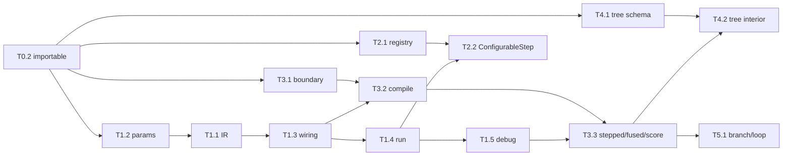

# decider: migration work plan

Companion to `Design.md` and `IR.md`. `Prompt.md` is the orchestrator handover. Edit inline; mark feedback with `>>> ... <<<`.

---

## 1. Conventions every task follows

These go into a project `CLAUDE.md` (task T0.1), so every agent picks them up
automatically.

**Comments and docstrings**

- Docstrings only on public API, written for library users. Each one is enough
  for someone (or an agent) to use the function correctly: a one-line summary,
  arguments where they aren't obvious, and optionally a short example and common
  usage.
- Private helpers: no docstring unless the behaviour is non-obvious. Inline
  comments explain *why*, never *what*.
- **Never** reference docs, section numbers, experiments, review findings,
  stages or "the agent". No `doc 03`, no `§4.2`, no `EXPERIMENTS.md`.
- Rationale of the "we chose X over Y because Y did Z" kind goes in
  `notes/<topic>.md`, and only when it is genuinely critical.

**Files**

- One purpose per file, ideally under 500 lines. Split into a package
  (`engine/ir/__init__.py` plus files) rather than growing a file.
- Exceptions go on an allowlist in the conventions test, with a reason.

**Ports**

- **Every worker starts by invoking the `ponytail:ponytail` skill in `ultra`
  mode**, and applies it throughout the port: the simplest code that passes the
  ported tests, no speculative abstractions, standard library before custom code.
  This line is repeated in every task brief, not just in `CLAUDE.md`.
- Ponytail never overrides the acceptance tests or `Design.md`. If simplifying
  would change behaviour the tests pin down, keep the behaviour and record the
  simplification as a `ponytail:` comment for later.
- Port behaviour, not text: rewrite the comments as part of the port.
- Port tests alongside the code. Test names describe behaviour.

**Enforced by `tests/test_conventions.py`**

- No file in `decider/` is over 500 lines, apart from allowlisted ones.
- No `doc \d\d`, `§` or `EXPERIMENTS` anywhere in `decider/**/*.py`.

---

## 2. Target layout

See `Design.md` §8. That is the single source for the layout, and `IR.md` §9
gives the file split for `steps/` and `engine/ir/`. Most decider2 source files
are long because of their docstrings, so trimming comments will shrink them;
split only what is still over 500 lines afterwards.

---

## 3. Model tiers

| Tier | Use for | Review |
|---|---|---|
| **Haiku** | Mechanical work with an exact spec: stubs, moving files, conventions test, CLI wiring, deletions | The orchestrator checks the diff and runs the tests |
| **Sonnet** | Well-specified ports and features whose behaviour is fixed by existing tests: params, boundary, registry changes, tree schema, config store, serving | The orchestrator reviews the diff against the spec plus the ported tests |
| **Opus** | New or critical design: the IR, wiring and resolution, runners, the debug session, the compiler, interiors, control flow | The orchestrator runs the `code-review` skill against `Design.md` / `IR.md`; the user reviews at phase checkpoints |

Working rules:

- **One task, one commit** on `feature/decider-v2`.
- Tasks that run in parallel use **separate git worktrees**, each on its own branch; the orchestrator merges them into `feature/decider-v2` and runs a post-merge step (full suite, conventions test, fixing up the joins).
- Each task brief gives the agent: the relevant `Design.md` sections, the source
  files to port, the exact files to create, the acceptance tests, and the
  conventions above.
- After every phase: full `pytest`, the conventions test, and a short summary to
  the user before starting the next phase.

---

## 4. Tasks

Legend: **H** = Haiku, **S** = Sonnet, **O** = Opus, **me** = done in the
planning session. "Depends on" lists the tasks that must finish first; tasks with no
unmet dependencies can run in parallel.

### Phase 0: groundwork

| ID | Task | Model | Depends on | Done when |
|---|---|---|---|---|
| T0.1 | Project `CLAUDE.md` with the conventions in §1, plus `tests/test_conventions.py` | H | — | Test passes on the current `decider/` |
| T0.2 | Make `decider` importable: remove or guard the imports of the missing `decider.config`, `GraphModule` and `decider.executor` in `serving/handler.py` and `settings.py`. Move the old top-level tests to `tests/_legacy/` and exclude it from collection. Add a pytest config so `uv run pytest` runs `tests/` only | H | — | `python -c "import decider, decider.serving"` passes; `uv run pytest` collects zero legacy tests and passes |
| T0.3 | ~~Rewrite `Design.md` to the final decisions~~ **Done** | me | — | — |
| T0.4 | Extract the critical decision records from decider2's docs and `EXPERIMENTS.md` into `notes/`: compile cache and real files vs `exec`, why fusion is explicit, `nogil` for serving, rounding and int64 overflow, stale union rebuilds, structure in Python, origins kept out of cache keys | S | — | About 6–10 short notes, each under a page, in "decision / why / what we tried" form |

### Phase 1: IR and interpreted engine (the critical path)

| ID | Task | Model | Depends on | Done when |
|---|---|---|---|---|
| T1.1 | `steps/` and `engine/ir/` exactly as specified in `IR.md` | O | T1.2 | The acceptance tests in `IR.md` §10 pass |
| T1.2 | `engine/params/`: port and split decider2 `params.py` and `bundles.py`; port `test_params_*` and `test_string_params`; add `param(shared_key=..., on_invalid=...)`; drop `not_applicable_as` and the reserved `shared` bundle (`IR.md` §5). The IR's `Step` harvests signatures with this, so it lands first | S | T0.2 | Ported tests pass |
| T1.3 | `engine/wiring/`: interface inference, resolution to a flat view with origins and stable ids, version chains, did-you-mean errors; port the wiring tests from `test_graph_*` | O | T1.1, T1.2 | Ported tests pass; every resolved step has an origin |
| T1.4 | `engine/run/`: `State`, generator runner protocol, interpreted runner, `Engine`/`Executable` (interpreted mode only), per-node param validation with `params_validation="eager" \| "lazy"` (IR.md §5.5) | O | T1.3 | Function steps run on a polars frame and give the same answers as decider2 interpreted mode; eager and lazy validation behave as `IR.md` §5.5 |
| T1.5 | `engine/debug/`: `Session`, breakpoints (path and prefix), `set` with an override version, `step`/`step_into`/`resume`/`pause`/`rewind`, events and commands with JSON round-trip | O | T1.4 | Break → inspect → set → resume changes the output; event log round-trips as JSON |

### Phase 2: config layer

| ID | Task | Model | Depends on | Done when |
|---|---|---|---|---|
| T2.1 | Registry, as `Design.md` §6: import-path tags plus aliases, `StepRef` nested dispatch with `SerializeAsAny`, replacement for the same qualified name, `json_schema()`, did-you-mean | S | T0.2 | Registry tests pass, including nested round-trip and dropped-field regression |
| T2.2 | `ConfigurableStep` integration: composes with `\|`, dumps and loads itself; example `ThresholdRule` test | S | T1.4, T2.1 | A pipeline mixing code and `ConfigurableStep`s gives identical output after a JSON round-trip of the config parts |
| T2.3 | Fresh-eyes usability review: with no prior context, write three small pipelines from the public docstrings alone (including a param reference in a tree document), and report what was confusing | H | T2.2 | A short report in `notes/usability-review-1.md`; findings triaged by the orchestrator |

### Phase 3: numba

T3.1 can start during Phase 1, because it is independent.

| ID | Task | Model | Depends on | Done when |
|---|---|---|---|---|
| T3.1 | Port `boundary/` and `_arrow/`; split `frame.py`; port `test_boundary_*` and `test_shim` | S | T0.2 | Ported tests pass |
| T3.2 | Port `compile/` into the split files; key the cache by content fingerprint, attach origins afterwards; port `test_compile_*` | O | T1.3, T3.1 | Ported tests pass; renaming a parent step causes no recompile; editing one step recompiles only its kernel |
| T3.3 | Stepped and fused runners as generators, and `score()` single-record path; sessions work in all three modes; lazy param validation on first hit (a fused kernel suspends and resumes; IR.md §5.5) | O | T1.5, T3.2 | Port `test_runtime_*`, `test_score_plan`, `test_no_arity_ceiling`; single-record latency within decider2's measured spec |
| T3.4 | Port `testing/` (equivalence, corpus, recompile) and `test_testing`, `test_shared_bundle_cache` | S | T3.3 | Ported tests pass; `assert_equivalent` covers sessions |

### Phase 4: trees, tables, scorecard

T4.1 can start during Phase 1, because it is independent.

| ID | Task | Model | Depends on | Done when |
|---|---|---|---|---|
| T4.1 | Port the tree schema into `steps/trees/schema/` (split the 1454 lines) and `steps/expr/`; port `test_expr` and the schema parts of the `test_trees_*` suites | S | T0.2 | Ported schema and expression tests pass |
| T4.2 | Trees as `TreeConfig.to_ir` → `row` `CallNode`: numba walker as `fn`, Python `reference` walker that emits node visits, node-id locator map, `Value[float]` thresholds | O | T3.3, T4.1 | All `test_trees*` pass; the reference walker agrees with the compiled one on the tree corpus; node breakpoints work |
| T4.3 | Tables following the tree pattern, with rows as `TableValue` (literal or table-valued param): port `tables/` and `test_tables*` | S | T4.2 | Ported tests pass, including reference-vs-compiled agreement |
| T4.4 | Scorecard as a `ConfigurableStep` whose `to_ir` builds steps, with semantics from decider_old's scorecard | S | T2.2 | Tests ported from decider_old's scorecard cases pass |

### Phase 5: control flow

| ID | Task | Model | Depends on | Done when |
|---|---|---|---|---|
| T5.1 | `Branch` and `Loop`: interpreted stepping into arms and iterations, compiled packing; port `test_control_flow*` | O | T3.3 | Ported tests pass; `step_into` enters the taken arm |
| T5.2 | Lift the limits on multi-step arms and multiple carries | O | T5.1 | New tests for multi-step arms and two carries |

### Phase 6: edges

| ID | Task | Model | Depends on | Done when |
|---|---|---|---|---|
| T6.1 | Config store from decider_old: file backends and versions; fix `pull_version`; remove polling that swallows exceptions | S | T2.1 | Store tests pass |
| T6.2 | Serving: handler imports the pipeline from code and takes params and interiors from the config store; port decider2's stage/activate/rollback and `test_serving`/`test_runtime_serve` | S | T3.3, T6.1 | Ported serving tests pass |
| T6.3 | CLI: `serve`, `build`/precompile, `template`; port `test_cli` | H | T6.2 | Ported tests pass |
| T6.4 | Websocket session adapter | S | T1.5 | A scripted client drives break/set/resume over a socket |
| T6.5 | `session.replace(path, step)` and `session.delete(path)`: edit a live session and re-run downstream | O | T3.3 | Replacing or deleting one step mid-session changes downstream values only |

### Phase 7: cleanup

| ID | Task | Model | Depends on | Done when |
|---|---|---|---|---|
| T7.1 | Delete `decider_old/` and `decider2/src` once their tests live under `tests/`; update `pyproject.toml`; remove the migration docs (`Plan.md`, `Prompt.md`) once done | H | all | Full suite green |

---

## 5. Critical path and parallelism

- **Critical path:** T0.2 → T1.2 → T1.1 → T1.3 → T1.4 → T1.5 → T3.3 → T4.2 / T5.1.
  Almost all of it is Opus work, and it can't be run in parallel.
- **Runs alongside Phase 1:** T0.1, T0.4, T2.1, T3.1 and T4.1. These are
  Haiku and Sonnet work in separate worktrees.
- **Rough share:** about 11 Opus tasks, 13 Sonnet and 4 Haiku.

---

## 6. Open questions about this plan

1. ~~Commit target~~ Decided: everything lands on `feature/decider-v2`. Each section may work on its own branch in its own worktree; the orchestrator merges into `feature/decider-v2` and runs a post-merge step (full test suite plus fixing up the joins).
2. ~~Sign-off on T1.1's API~~ Decided: `IR.md` is the signed-off contract. The orchestrator stops for user review after Phase 1, and again whenever the public API in `IR.md` would have to change.
3. ~~Move `Design.md` / `Plan.md` out of the package~~ Done: both are now at the repo root.
