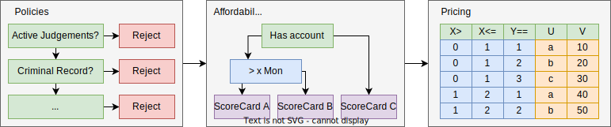

Spockflow
=========

Spock is a python framework aimed at creating standalone micro-services that enrich data with actionable outputs. Spock supports both batch and live inference modes. Spock extends existing frameworks to provide a simplistic abstraction for common data flows including policy rules and scoring. Spock is designed to be extensible and modular allowing pipelines and config to be reused in multiple flows. Finally, a large emphasis is placed on runtime traceability and explainability by leveraging Hamilton which is a well established python framework. This allows the lineage of data to be tracked and visualised as well as enabling the steps in a process that lead to a certain outcome to be easily identifiable.

.. figure:: ./_static/getting-started/example_pipeline.drawio.svg
   :scale: 100
   :align: center
   :class: only-dark

 
Components
----------

Spock provides the following tools 

- **Scorecards**: Providing an understandable way to assign scores to entities based on various parameters.
- **Decision Tables**: Enables input values to be mapped to output values based on a set of conditions.
- **Decision Trees**: Empowers the developer to specify a set of potentially nested rules which can be used for policies or to choose outputs based on the aforementioned rules.
- **General Transformations**: Often times simplistic transformations are required as part of the process and can be done using simple python code.
- **User driven components**: The framework provides a simple interface that can be used to enable the user to extend Spock and create custom reusable components.

Why Spock
---------

- Spock enables Data Scientists to own the deployment of their models enabling a quicker time to production.
- Easy handover to maintenance teams due to the ability to export core components as config.
- Hamilton provides a form of runtime traceability
- Components in the Spock ecosystem can be easily adjusted to tweak performance, throughput and for general maintenance.
- Spock is built into DSP (and follows the Sagemaker standard) allowing it to leverage all of the existing capabilities out-of-the-box including:
    - easy EDL, EDW and feature platform integration
    - Model lifecycle with CICD integration
    - EDA and a development environment
    - Monitoring
    - Methods for both batch and live predictions using a single codebase

- The python programming ecosystem
    - Python is a popular language among Data Scientists
    - Many libraries exist for python
    - Python and the abstractions provided by spock make the development of custom components easy
    - Tooling including: IDEs, static code analysers (validation), code completion

Use Cases
---------

- **Credit Granting**: A general credit granting flow will consist of ARODS, Affordability, Risk assessment and Pricing. Spock provides the following:
    - abstractions over Decision trees to assist with ARODS,
    - Scorecards for affordability and risk assessments and decision trees to allow results to be selected from scorecard based on a set of criteria,
    - Decision tables are typically used to form a price from the resulting affordability and risk assessment.

- **Fraud**: Fraud is typically a flat set of rules used to detect fraudulent transactions. The decision tree functionality can be used to provide binary labels to the data.

When to look elsewhere
---------

- Spock is a function level orchestrator but is not intended to orchestrate multiple micro-services.
- Spock is intended to run on a record level and is not designed to aggregate multiple records
- Spock is stateless so all information needed to process records must be provided as part of the inputs to the flow.
- Spock does not provide any means to perform actions but merely enriches the output data
- Spock does not intend to provide a encumbering ui for development of arbitrary flows.
